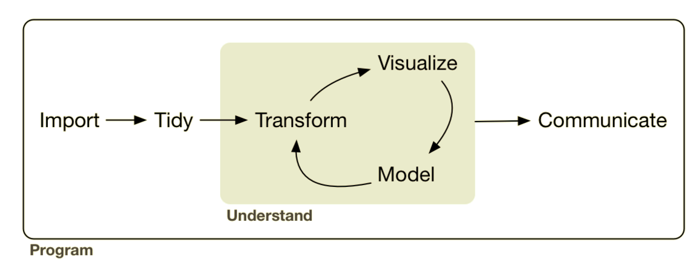

```{r setup, include=FALSE}
options(htmltools.dir.version = FALSE)
knitr::opts_chunk$set(warning = FALSE, 
                      message = FALSE, 
                      cache = TRUE, 
                      fig.align = 'center')
```


background-image: url(img/spreadsheet.png)

???

I'm going to start off by describing a pretty common scenario, and then talk about how using **R** can help:

- You're doing a big project for a client. You have a four or five spatial files and a few csvs or Excel sheets containing more data related to the spatial layers. 
- First you do a bunch of data cleaning in the spreadsheets - fixing date formats, unit conversions, transformations, unify inconsistent variable names, etc.

---

background-image: url(img/arcmap.jpg)

???

- You import the layers into a GIS, do a bunch of spatial operations - intersects, unions, buffers, spatial joins, etc.
- You import the tabular data and join it to the appropriate layers, and do more work.

---

background-image: url(img/arcmap-layout.jpg)

???

- Spend some time creating really nice looking map for final report

---

background-image: url(img/graph.png)

???

- Export the tabular data out so you can summarize it and make some nice graphs in Excel

---

background-image: url(img/cycle.png)

???

- Combine the results in a word document, convert it to a pdf and give to your client. They thank you for your great work, but say 'Oh, I think I gave you the wrong version of one of the spatial files, and that Excel spreadsheet has been updated.'

---

background-image: url(img/leia-what.gif)

???

- Can you redo the analysis exactly the same way? How long will it take you?

---

# Data Science
.center[]

.footnote[Wickham and Grolemund: [R for Data Science](http://r4ds.had.co.nz/)]

---

background-image: url(img/Rlogo.png)

## Open source programming language
## Data analysis focus
## Cross-platform

???

# What is R?

- R is an open-source programming language for data analysis and visualization.
  - In many ways it is similar to other general purpose interpreted languages like Python, but unlike Python, R was originally created as a statistical programming language and so it is designed from the ground up around the manipulation, analysis, and visualization of data - it is now often considered the 'lingua franca' of data.
  - It also easy to make publication-quality graphics.
  - R is available for Windows, MacOS and most popular Linux distributions.
  - You can run it interactively by typing directly into the console, or from a sequence of commands written in text files, or "scripts". Scripts can be run against a dataset to produce a defined output, such as a chart or another dataset which contains the results of the analysis.


---

background-image: url(img/Rlogo.png)

## Efficiency (Honda civic)

???

So, what can **R** give you?

Efficiency:

The entire workflow can be done efficiently in **R**, including:

- reading in raw data from many different sources - spatial and non-spatial, 
- preparing the data for analysis, including easily integrating tabular and spatial data,
- performing spatial data manipulation and analysis,
- performing statistical analysis
- creating publication-quality graphs and figures.

---

background-image: url(img/Rlogo.png)

## Reproducibility (photocopier)

???

Reproducibilty means:

- *You can easily recreate or update exactly what you did*: In the scenario I described, If you coded the entire above workflow in an R script, you can just change a few lines to change the input data and rerun the scripts.
- *You know what you did*: Doing your data preparation and analysis by coding it in **R** necessarily documents every step. The analysis and documentation are inextricably intertwined.
- *Others know what you did*: They can inspect and re-run your code to understand what you did, verify you've done it correctly, and build on your work.

---

background-image: url(img/Rlogo.png)

## Reliability (k-car)

???

Using **R** can help you:

- *Minimize errors*: point and click and copy and paste operations are very error-prone, and it's hard to catch those errors
- And you can *find and correct errors* more easily: Changing a bit of code and re-running your script is much more efficient than doing it manually (without making another error).

---

background-image: url(img/Rlogo.png)

## Versatility (pliers)

???

R has a huge array of add-on packages that extend the capabilities of R for performing diverse tasks, including:

- data manipulation, 
- data visualization, and
- almost every statistical method you can think of
- With a wide range of packages R also supports advanced geospatial statistics, modeling and visualization.
- Packages are generally published on CRAN - or the "Comprehensive R Archive Network", these packages are easily installable by a user from within R.

---

background-image: url(img/Rlogo.png)

## Community

???

I think one of the best reasons to use **R** is the:

Fantastic online **R** Community

- **R** is hugely popular right now.
- If you have a question or are having a problem, 99% of the time you'll find that it has already been asked and answered online. And if it hasn't, people are almost always willing to help out.
- (rstats, community.rstudio.com, mailing lists, StackOverflow, RWeekly)

---

### .center[Geographic Information Systems (GIS)</br>vs</br>Geographic Data Science (GDS)<sup>1</sup>]

.middle[
```{r echo=FALSE}
library(readr)
tbl_11.1 <- read_csv('Attribute,GIS,GDS
Home disciplines,Geography,"Geography, Computing, Statistics"
Software focus,Graphical User Interface,Code
Reproduciblility,Minimal,Maximal')

knitr::kable(tbl_11.1, format = "html")
```
]

.footnote[
[1] Geocomputation with R, [Table 1.1](https://geocompr.robinlovelace.net/intro.html#tab:gdsl)
]

???

Why R for spatial?

- Generally the same arguments as I made above for general data analysis.

- reading, writing and manipulating spatial data; making static and interactive maps; applying geocomputation to solve real-world problems; and spatial statistics and modelling

- Ability to seamlessly switch between spatial and non-spatial data processing, modeling and visualization tasks

---


```{r eval=require(leaflet)}
leaflet() %>%
  addProviderTiles("Stamen.TonerLite") %>% 
  addAwesomeMarkers(lng = -123.369407, lat = 48.428881, 
                    label = paste0("<h3>", emo::ji("beer"), "</h3>"), 
                    labelOptions = labelOptions(noHide = TRUE))
```

---
background-image: url(img/vic-open-data.png)
---

```{r}
library(sf)
library(mapview)

dogs <- read_sf("data/dogs/DogsByNeighbourhood.shp")

mapview(dogs)
```

---

```{r}
library(ggplot2)

ggplot() + 
  geom_sf(data = dogs, aes(fill = DogLicence)) + 
  scale_fill_viridis_c() + theme_minimal()
```

---

```{r}
hydrants <- read_sf("data/hydrants/Hydrants.shp")

ggplot() + 
  geom_sf(data = hydrants) + 
  theme_minimal()
```

---

```{r}
hydrants <- st_intersection(hydrants, st_geometry(dogs))
ggplot() + 
  geom_sf(data = dogs, aes(fill = DogLicence)) + 
  geom_sf(data = hydrants, colour = "white") + 
  scale_fill_viridis_c() + theme_minimal()
```

---

```{r eval=require(dplyr)}
dogs_and_hydrants <- st_join(dogs, hydrants) %>% 
  group_by(Neighbourh) %>% 
  summarize(licences = max(DogLicence), 
            n_hydrants = length(unique(ID)), 
            hydrants_per_dog = n_hydrants / licences)
```

---

```{r}
ggplot() + 
  geom_sf(data = dogs_and_hydrants, aes(fill = hydrants_per_dog)) + 
  scale_fill_viridis_c() + theme_minimal()
```

---

```{r}
ggplot(dogs_and_hydrants, aes(x = Neighbourh, y = hydrants_per_dog)) + 
  geom_col(aes(fill = licences)) + scale_fill_viridis_c() + 
  coord_flip() + theme_minimal()
```


---

## Resources:

http://fg2re.sellorm.com/

http://r4ds.had.co.nz/

https://geocompr.robinlovelace.net/

http://r-spatial.org/
